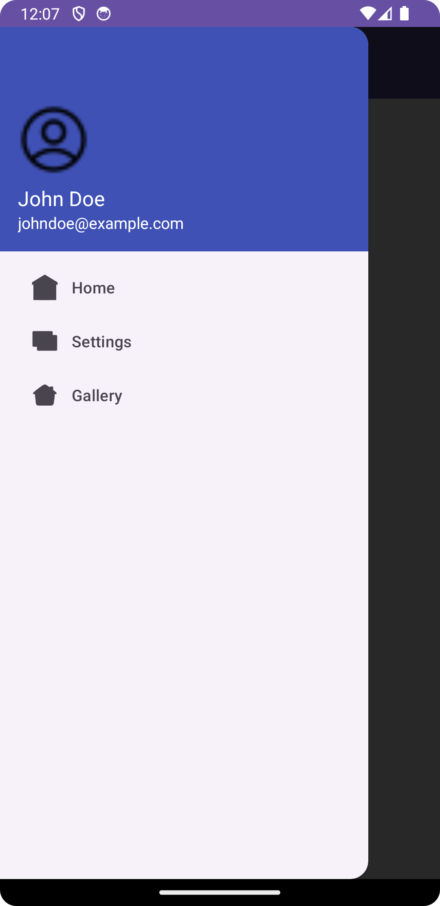

# MyAndroidApp

This Android application demonstrates the implementation of a navigation drawer with a toolbar.

## Features

- Navigation drawer with multiple fragments.
- Toolbar used as the app's ActionBar.
- Easily customizable for adding more features or functionality.

- 
## Setup

1. **Clone the repository:**

    ```bash
    git clone https://github.com/your_username/MyAndroidApp.git
    ```

2. **Open with Android Studio:**

    - Launch Android Studio.
    - Click on "Open an existing Android Studio project."
    - Navigate to the cloned repository and select the `MyAndroidApp` directory.
    - Wait for the project to sync and build.

3. **Run the app:**

    - Connect your Android device or use an emulator.
    - Click on the "Run" button in Android Studio.

## Structure

The app's structure includes:

- `MainActivity`: Entry point of the app with the navigation drawer setup.
- Fragments: Home, Settings, Gallery, etc.
- Layouts: Activity layout (`activity_main.xml`), fragment layouts, navigation drawer menu layout.

## Customization

- **Changing Fragments:** To modify or add fragments, edit the corresponding Kotlin files and layout XMLs.
- **Toolbar Customization:** Update the Toolbar in `activity_main.xml` and customize its appearance or functionality in `MainActivity.kt`.

## Resources

- [Android Developer Documentation](https://developer.android.com/docs)
- [Material Design Guidelines](https://material.io/design)

## License

This project is licensed under the [MIT License](LICENSE).
